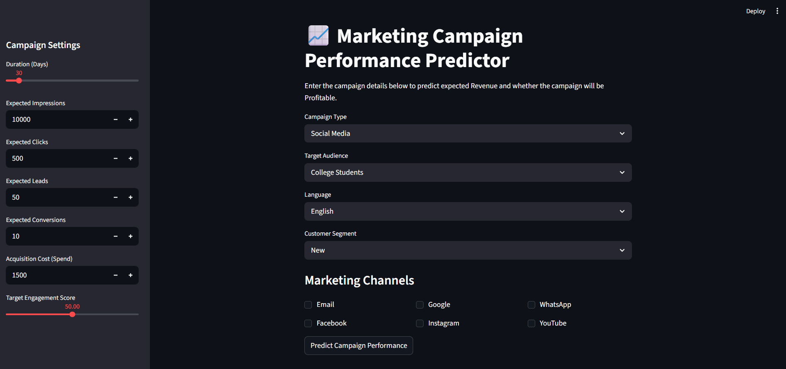

# Multi-Brand-Marketing-Performance-Analysis-Prediction
An end-to-end Machine Learning web application built with Streamlit and Scikit-Learn to forecast marketing campaign revenue and evaluate profitability risks (Profit/Loss) using interactive Plotly funnel visualizations. Includes initial exploratory SQL insights via PostgreSQL.

This project was built from the ground up, starting with exploratory SQL data analysis, progressing through feature engineering and model training, and culminating in a live, interactive web dashboard.

---
## 🖥️ Live Dashboard Interface

---
## 💻 Tech Stack

**Programming Language:**
* Python (3.13)

**Machine Learning & Predictive Modeling:**
* **Scikit-Learn:** Built, trained, and evaluated both Regression and Classification models.
* **Joblib:** Serialized and deployed the trained models.

**Data Engineering & Processing:**
* **Pandas:** Handled data cleaning, feature engineering, and pipeline structuring.
* **NumPy:** Executed numerical operations and scaling.

**Frontend Application & Deployment:**
* **Streamlit:** Powered the interactive, web-based dashboard UI.

**Data Visualization:**
* **Plotly:** Rendered interactive, enterprise-grade charts inside the live dashboard.
* **Matplotlib & Seaborn:** Generated static insights and correlation heatmaps during the EDA phase.

**Database Management:**
* **PostgreSQL / pgAdmin:** Stored structured campaign data and facilitated SQL queries to isolate historical trends and Top ROI campaigns.

---

## 🧠 Machine Learning Architecture

This application utilizes a dual-engine machine learning approach to provide comprehensive business insights:

1. **Revenue Prediction (Regression):** * **Algorithm:** Linear Regression
   * **Performance:** Achieved an $R^2$ score of 0.77.
   * **Function:** Forecasts the continuous numerical output of expected campaign revenue based on audience engagement and scale.

2. **Profitability Prediction (Classification):**
   * **Algorithm:** Logistic Regression
   * **Performance:** Achieved 91.1% Accuracy and an F1-Score of 0.94.
   * **Function:** Acts as a risk-management classifier, analyzing efficiency margins to definitively flag a campaign as a "Profit" or a "Loss".

> **Note on Model Integrity:** During the feature engineering phase, the direct `ROI` column was explicitly dropped prior to training. This eliminated data leakage, ensuring the models learned the actual behavioral relationships of the marketing funnel rather than simply memorizing an algebraic formula.

---

## 📂 Repository Structure

**1. Data Pipeline & Training Scripts**
* `eda.py` — Script used for Exploratory Data Analysis, statistical checks, and generating correlation heatmaps.
* `train_models.py` — The core machine learning pipeline. This script cleans the data, handles one-hot encoding, trains the Scikit-Learn models, and exports them.
* `main.py` — The primary orchestration script for executing the backend data processes.

**2. Deployment & Application**
* `campaign_dashboard.py` — The main Streamlit web application script for live predictions.
* `revenue_regression_model.pkl` — The serialized Linear Regression model (generated by `train_models.py`).
* `profit_classification_model.pkl` — The serialized Logistic Regression model (generated by `train_models.py`).
* `model_features.pkl` — The saved column structure to ensure consistent UI input encoding.

**3. Documentation & Setup**
* `requirements.txt` — List of required Python dependencies.
* `/images` — Contains screenshots of the SQL queries, EDA charts, and the live Streamlit Dashboard.

---

## 🚀 How to Run Locally

To run this application on your local machine, follow these steps:

**1. Clone the repository:**
`bash
git clone https://github.com/YourUsername/Your-Repo-Name.git
cd Your-Repo-Name
`

**2. Install dependencies:**
`bash
pip install -r requirements.txt
`

**3. (Optional) Retrain the Machine Learning Models:**
If you want to view the model training process or retrain the algorithms on new data, run the training script. This will generate fresh `.pkl` files:
`bash
python train_models.py
`

**4. Launch the Live Streamlit Dashboard:**
To boot up the interactive user interface, run:
`bash
streamlit run campaign_dashboard.py
`
